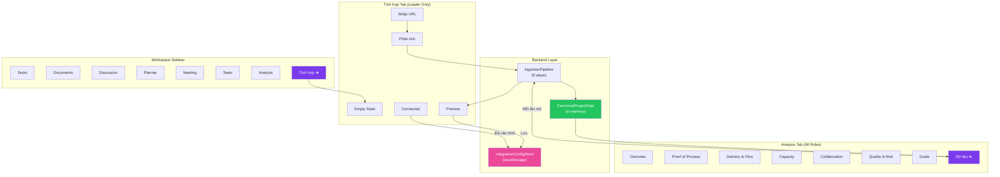
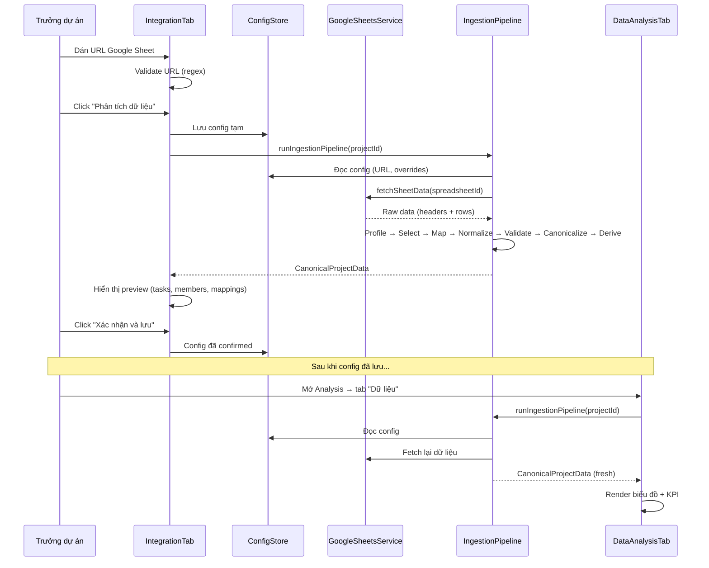

# 📋 BÁO CÁO TỔNG THỂ — Hệ thống Tích hợp Dữ liệu theo Dự án

> **Dự án**: TalentNet — Nền tảng Cộng tác Dự án  
> **Phiên bản**: v2.0 (Project-Centric Integration)  
> **Ngày**: 09/04/2026  
> **Stack**: React 18 + TypeScript + Vite + shadcn/ui + Tailwind CSS + Recharts

---

## MỤC LỤC

1. [Tổng quan kiến trúc](#1-tổng-quan-kiến-trúc)
2. [Luồng dữ liệu](#2-luồng-dữ-liệu)
3. [Bản đồ file](#3-bản-đồ-file)
4. [Chi tiết tính năng](#4-chi-tiết-tính-năng)
5. [Cơ chế phân quyền](#5-cơ-chế-phân-quyền)
6. [Pipeline xử lý dữ liệu](#6-pipeline-xử-lý-dữ-liệu-9-bước)
7. [Quy tắc lưu trữ](#7-quy-tắc-lưu-trữ)
8. [Hướng dẫn tự test](#8-hướng-dẫn-tự-test)

---

## 1. TỔNG QUAN KIẾN TRÚC

### Mô hình trước (cũ)

```
Người dùng → DataVault (thư viện cá nhân) → Google Sheets
                    ↕ (không liên kết)
             Analysis tab (dữ liệu giả cố định)
```

**Vấn đề**: Dữ liệu được quản lý theo **người dùng**, không theo dự án. Analysis tab dùng hoàn toàn mock data, không kết nối với bất kỳ nguồn dữ liệu thật nào.

### Mô hình mới

```
Trưởng dự án → Cấu hình nguồn dữ liệu (theo dự án)
                    ↓
              Ingestion Pipeline (9 bước)
                    ↓
              Canonical Data (in-memory, KHÔNG lưu trữ)
                    ↓
              Analysis "Dữ liệu" tab (biểu đồ, thống kê)
                    ↑
              Thành viên (chỉ xem, không cấu hình)
```

### Sơ đồ kiến trúc tổng thể



---

## 2. LUỒNG DỮ LIỆU

### Luồng chính: Kết nối → Phân tích



### Quy tắc bất biến

| Quy tắc | Mô tả |
|---------|-------|
| **Config-only persistence** | Chỉ lưu cấu hình (URL, sync interval, column overrides). Dữ liệu canonical KHÔNG BAO GIỜ được lưu vào localStorage |
| **Re-compute on load** | Mỗi khi mở tab "Dữ liệu", pipeline chạy lại từ đầu. Đảm bảo dữ liệu luôn fresh |
| **Leader-only config** | Chỉ trưởng dự án thấy và tương tác được tab "Tích hợp" |
| **Vietnamese errors** | Tất cả thông báo lỗi đều bằng tiếng Việt |

---

## 3. BẢN ĐỒ FILE

### File mới tạo (6 file)

| File | Kích thước | Vai trò |
|------|-----------|---------|
| [canonicalTypes.ts](file:///c:/Users/thain/Downloads/idea-nests-main/idea-nests-main/idea-nests/src/lib/canonicalTypes.ts) | ~170 dòng | Contract dữ liệu — định nghĩa tất cả type cho hệ thống |
| [integrationConfigStore.ts](file:///c:/Users/thain/Downloads/idea-nests-main/idea-nests-main/idea-nests/src/lib/integrationConfigStore.ts) | ~65 dòng | CRUD cấu hình tích hợp theo dự án (localStorage) |
| [ingestionPipeline.ts](file:///c:/Users/thain/Downloads/idea-nests-main/idea-nests-main/idea-nests/src/lib/ingestionPipeline.ts) | ~660 dòng | Engine xử lý dữ liệu 9 bước — core logic của hệ thống |
| [useProjectRole.ts](file:///c:/Users/thain/Downloads/idea-nests-main/idea-nests-main/idea-nests/src/hooks/useProjectRole.ts) | ~40 dòng | Hook phân quyền leader/member |
| [IntegrationTab.tsx](file:///c:/Users/thain/Downloads/idea-nests-main/idea-nests-main/idea-nests/src/components/workspace/IntegrationTab.tsx) | ~350 dòng | UI quản lý tích hợp (wizard 5 bước) |
| [DataAnalysisTab.tsx](file:///c:/Users/thain/Downloads/idea-nests-main/idea-nests-main/idea-nests/src/components/project-analysis/DataAnalysisTab.tsx) | ~330 dòng | UI phân tích dữ liệu (biểu đồ Recharts) |

### File đã sửa (3 file)

| File | Thay đổi |
|------|----------|
| [ProjectWorkspace.tsx](file:///c:/Users/thain/Downloads/idea-nests-main/idea-nests-main/idea-nests/src/pages/ProjectWorkspace.tsx) | Thêm tab "Tích hợp" + role gating + import mới |
| [ProjectAnalysisContent.tsx](file:///c:/Users/thain/Downloads/idea-nests-main/idea-nests-main/idea-nests/src/components/project-analysis/ProjectAnalysisContent.tsx) | Thêm tab "Dữ liệu" vào analysis tabs |
| [Sidebar.tsx](file:///c:/Users/thain/Downloads/idea-nests-main/idea-nests-main/idea-nests/src/components/layout/Sidebar.tsx) | Xóa link "Thư viện" khỏi sidebar |

### File KHÔNG bị thay đổi (quan trọng)

> [!NOTE]
> Các file sau **không bị ảnh hưởng** bởi refactor. Tất cả tính năng hiện tại vẫn hoạt động bình thường:

- `App.tsx` — Routing không thay đổi, `/library` vẫn truy cập được
- `dataVaultStore.ts` — Store gốc giữ nguyên
- `syncEngine.ts` — Sync engine giữ nguyên
- `googleSheetsService.ts` — Mock service giữ nguyên (pipeline sử dụng chung)
- Tất cả 7 analysis sub-tabs gốc (Overview, Proof of Process, etc.) — giữ nguyên mock data
- Tất cả workspace components (Tasks, Documents, Discussion, etc.) — không thay đổi

---

## 4. CHI TIẾT TÍNH NĂNG

### 4.1 Tab "Tích hợp" (IntegrationTab)

**Vị trí**: Workspace sidebar → sau "Analysis"  
**Quyền**: Chỉ trưởng dự án (leader)  
**Mục đích**: Cấu hình nguồn dữ liệu Google Sheets cho dự án

#### Trạng thái UI

| Trạng thái | Mô tả | Hành động có sẵn |
|------------|-------|------------------|
| **Empty** | Chưa kết nối — hiển thị CTA "Kết nối Google Sheets" | Bắt đầu setup |
| **URL Input** | Form nhập URL + chọn tần suất đồng bộ | Validate URL tự động, "Phân tích dữ liệu" |
| **Loading** | Spinner xoay + thông báo đang phân tích | Đợi |
| **Preview** | Kết quả: số task/member, ánh xạ cột, cảnh báo | "Xác nhận và lưu" / "Quay lại" |
| **Connected** | Đã kết nối — hiển thị trạng thái + metadata | "Làm mới" / "Cấu hình lại" / "Ngắt kết nối" |

#### Preview hiển thị gì?

- **4 KPI**: Số công việc, số thành viên, % hoàn thành, % độ tin cậy ánh xạ
- **Ánh xạ cột**: Từng cột nguồn → field canonical + confidence + detection method
- **Cảnh báo**: Nếu nhiều hàng bị bỏ qua, dữ liệu thiếu column, v.v.

---

### 4.2 Tab "Dữ liệu" (DataAnalysisTab)

**Vị trí**: Analysis → tab cuối cùng "Dữ liệu"  
**Quyền**: Tất cả vai trò (leader, member, investor)  
**Mục đích**: Hiển thị phân tích trực quan từ dữ liệu đã tích hợp

#### Nội dung hiển thị

| Section | Mô tả |
|---------|-------|
| **Header** | Tiêu đề + nguồn dữ liệu + thời gian cập nhật + nút "Làm mới" |
| **Cảnh báo** | Warning/info bars nếu có vấn đề dữ liệu |
| **4 KPI Cards** | Tổng công việc, % hoàn thành (có progress bar), số thành viên, % độ tin cậy |
| **Biểu đồ tròn** | Phân bổ trạng thái (todo/in_progress/done/blocked/...) — màu sắc riêng biệt |
| **Biểu đồ cột ngang** | Khối lượng công việc theo thành viên (top 10) |
| **Thẻ cảnh báo** | Trễ hạn (overdue) + Bị chặn (blocked) — nếu có |
| **Grid thành viên** | Danh sách thành viên nhận dạng được — avatar chữ cái, tên, vai trò, email, số task |
| **Source provenance** | Thông tin nguồn: provider, số hàng gốc/hợp lệ/bỏ qua |

#### Empty states

| Điều kiện | Hiển thị |
|-----------|---------|
| Leader + chưa cấu hình | "Chưa kết nối nguồn dữ liệu" + CTA đi đến tab Tích hợp |
| Member + chưa cấu hình | "Trưởng dự án chưa kết nối nguồn dữ liệu" |
| Đã cấu hình + đang load | Spinner + "Đang phân tích dữ liệu..." |
| Đã cấu hình + lỗi | Thông báo lỗi tiếng Việt + nút "Thử lại" |

---

### 4.3 Sidebar đã thay đổi

| Mục | Trạng thái |
|-----|-----------|
| Home | ✅ Giữ nguyên |
| Your Projects | ✅ Giữ nguyên |
| ~~Thư viện~~ | ❌ Đã xóa khỏi sidebar (trang `/library` vẫn truy cập được bằng URL trực tiếp) |
| Dashboard | ✅ Giữ nguyên |
| People | ✅ Giữ nguyên |

---

## 5. CƠ CHẾ PHÂN QUYỀN

### Hook `useProjectRole(projectId)`

```typescript
// Trả về:
{
  isLeader: boolean;   // Có quyền cấu hình tích hợp?
  isMember: boolean;   // Là thành viên dự án?
  role: "leader" | "member" | "viewer";
}
```

### Logic xác định vai trò (mô phỏng)

| Điều kiện | Vai trò | isLeader |
|-----------|---------|----------|
| Project ID bắt đầu bằng `user-` VÀ tồn tại trong `talentnet_created_projects` | Leader | ✅ |
| Project ID là `1`, `2`, `3`, `proj_solarsense`, `proj_codementor`, `proj_ecotrack` | Leader | ✅ |
| Còn lại | Member | ❌ |

### Ảnh hưởng đến UI

| Phần tử UI | Leader | Member |
|-----------|--------|--------|
| Tab "Tích hợp" trong sidebar | **Hiển thị** | **Ẩn hoàn toàn** (không disable, không xám — hoàn toàn vắng mặt) |
| Tab "Dữ liệu" trong Analysis | Hiển thị | Hiển thị |
| Nội dung "Dữ liệu" khi chưa config | CTA đi đến Tích hợp | Thông báo đợi trưởng dự án |
| Nội dung "Dữ liệu" khi đã config | Biểu đồ + KPI | Biểu đồ + KPI (giống leader) |

---

## 6. PIPELINE XỬ LÝ DỮ LIỆU (9 BƯỚC)

### Tổng quan

```mermaid
graph LR
    S1["1. FETCH"] --> S2["2. PROFILE"]
    S2 --> S3["3. SELECT"]
    S3 --> S4["4. MAP"]
    S4 --> S5["5. NORMALIZE"]
    S5 --> S6["6. VALIDATE"]
    S6 --> S7["7. CANONICALIZE"]
    S7 --> S8["8. DERIVE"]
    S8 --> S9["9. RETURN"]

    style S1 fill:#3b82f6,color:#fff
    style S4 fill:#f59e0b,color:#fff
    style S7 fill:#22c55e,color:#fff
    style S9 fill:#8b5cf6,color:#fff
```



### Chi tiết từng bước

#### Bước 1: FETCH
- Đọc config từ `integrationConfigStore`
- Trích xuất `spreadsheetId` từ URL
- Gọi `fetchSheetData()` (hiện tại là mock, tương lai là API thật)

#### Bước 2: PROFILE  
- Phân tích cấu trúc tab: headers, rows, density
- Tính điểm cho mỗi tab theo công thức weighted:

```
FinalTabScore = 0.24 × header_semantics
              + 0.22 × cell_pattern_signal
              + 0.14 × data_density
              + 0.14 × canonical_field_coverage
              + 0.10 × cross_column_consistency
              + 0.08 × row_quality
              + 0.08 × user_value
              - 0.10 × noise_penalty
```

#### Bước 3: SELECT
- Chọn tab chính (highest score) → `use_primary`
- Nhận dạng tab hỗ trợ (member list, timeline) → `use_supporting`
- Loại tab rác (backup, temp, test) → `ignore`

#### Bước 4: MAP (5 chiến lược ensemble)

| Chiến lược | Độ ưu tiên | Confidence | Ví dụ |
|-----------|-----------|-----------|-------|
| **Exact match** | Cao nhất | 0.95 | "Trạng thái" → `task_status` |
| **Fuzzy match** (Levenshtein ≤ 2) | Cao | 0.75 | "Trang thai" → `task_status` |
| **Value pattern** | Trung bình | 0.55-0.85 | Cột có 80% giá trị là email → `member_email` |
| **Positional** | Thấp | 0.25-0.35 | Cột đầu tiên → `task_name` |
| **Cross-column** | Bổ trợ | — | Nếu cùng hàng có tên + vai trò → chắc là member list |

**Từ điển đồng nghĩa**: ~150 từ Vietnamese + English cho 16 trường canonical.

#### Bước 5: NORMALIZE
- **Status**: "Hoàn thành" → `done`, "Đang xử lý" → `in_progress`, "Chờ duyệt" → `in_review` (~40 giá trị)
- **Priority**: "Khẩn cấp" → `urgent`, "Cao" → `high`, "P2" → `medium` (~15 giá trị)
- **Date**: DD/MM/YYYY, YYYY-MM-DD, "15 tháng 3", "Mar 15" → ISO 8601
- **Percentage**: "85%", "85", "0.85" → number 0-100
- **Name**: Vietnamese unaccent + lowercase + sort tokens → fingerprint

#### Bước 6: VALIDATE
- Reject nếu không tìm được task/member nào
- Warn nếu >30% hàng bị bỏ qua
- Warn nếu column mapping thấp

#### Bước 7: CANONICALIZE
- Tạo `CanonicalTask[]` từ rows + mappings
- Tạo `CanonicalMember[]` từ assignee names + member tab
- Dedup members bằng name fingerprint

#### Bước 8: DERIVE
- Tính `DerivedInsights`: completion %, tasks by status, tasks by assignee, overdue, blocked

#### Bước 9: RETURN
- Trả về `CanonicalProjectData` — never persist

---

## 7. QUY TẮC LƯU TRỮ

### localStorage Keys

| Key | Nội dung | Quản lý bởi |
|-----|---------|-------------|
| `talentnet_project_integrations` | **MỚI** — Array cấu hình tích hợp theo dự án | `integrationConfigStore.ts` |
| `talentnet_created_projects` | Danh sách dự án đã tạo | `projectStore.ts` (không thay đổi) |
| `talentnet_datavault_*` (7 keys) | DataVault cũ (documents, sources, accounts, ...) | `dataVaultStore.ts` (không thay đổi) |

### Cấu trúc config được lưu

```json
[
  {
    "project_id": "1",
    "sheet_url": "https://docs.google.com/spreadsheets/d/...",
    "provider": "google_sheets",
    "sync_interval": 15,
    "column_overrides": [],
    "configured_by": "current_user",
    "configured_at": "2026-04-09T03:00:00.000Z"
  }
]
```

> [!CAUTION]
> **CanonicalProjectData KHÔNG được lưu ở bất kỳ đâu**. Nó được tính toán lại mỗi lần bạn mở tab "Dữ liệu" hoặc nhấn "Làm mới". Đây là by design — đảm bảo dữ liệu luôn fresh và không chiếm localStorage.

---

## 8. HƯỚNG DẪN TỰ TEST

### Chuẩn bị

```bash
# 1. Mở terminal tại thư mục dự án
cd c:\Users\thain\Downloads\idea-nests-main\idea-nests-main\idea-nests

# 2. Khởi chạy dev server
npm run dev

# 3. Mở trình duyệt tại
# http://localhost:8080
```

---

### Kịch bản 1: Kiểm tra tab "Tích hợp" hiển thị cho Leader

| Bước | Hành động | Kết quả mong đợi |
|------|----------|------------------|
| 1 | Vào `http://localhost:8080/workspace/1` | Workspace mở ra với sidebar |
| 2 | Nhìn sidebar bên trái | Thấy mục **"Tích hợp"** (icon Database) **sau** mục "Analysis" |
| 3 | Click vào "Tích hợp" | Trang hiển thị "Tích hợp dữ liệu" với empty state |

> [!TIP]
> Project ID `1` được coi là demo project → luôn là leader. Nếu bạn muốn test member, cần sửa file `useProjectRole.ts` tạm thời.

---

### Kịch bản 2: Kết nối Google Sheet

| Bước | Hành động | Kết quả mong đợi |
|------|----------|------------------|
| 1 | Ở tab Tích hợp, click **"Kết nối Google Sheets"** | Form nhập URL xuất hiện |
| 2 | Dán URL: `https://docs.google.com/spreadsheets/d/1BxiMVs0XRA5nFMdKvBdBZjgmUUqptlbs74OgVE2upms/edit` | ✅ Icon xanh xuất hiện bên phải input |
| 3 | Giữ tần suất đồng bộ là "Mỗi 15 phút" | Dropdown hiển thị đúng |
| 4 | Click **"Phân tích dữ liệu"** | Loading spinner → rồi hiển thị preview |
| 5 | Kiểm tra preview | Thấy: số Công việc, số Thành viên, % Hoàn thành, % Độ tin cậy |
| 6 | Kiểm tra ánh xạ cột | Thấy danh sách cột nguồn → canonical field + confidence |
| 7 | Click **"Xác nhận và lưu"** | Toast "Đã kết nối nguồn dữ liệu thành công!" |
| 8 | Trang chuyển sang trạng thái "Connected" | Thấy nút "Làm mới", "Cấu hình lại", icon thùng rác |

---

### Kịch bản 3: Xem phân tích dữ liệu

| Bước | Hành động | Kết quả mong đợi |
|------|----------|------------------|
| 1 | Click **"Analysis"** ở sidebar | Analysis page mở ra |
| 2 | Nhìn hàng tab phía trên | Thấy tab mới **"Dữ liệu"** (icon Database) ở cuối danh sách |
| 3 | Click tab **"Dữ liệu"** | Loading spinner → rồi hiển thị dashboard |
| 4 | Kiểm tra 4 KPI cards | Tổng công việc, % Hoàn thành, Số thành viên, Độ tin cậy |
| 5 | Kiểm tra biểu đồ tròn | "Phân bổ trạng thái" — có legend + nhãn |
| 6 | Kiểm tra biểu đồ cột ngang | "Khối lượng theo thành viên" — bar chart tím |
| 7 | Cuộn xuống | Thấy grid "Thành viên được nhận dạng" với avatar chữ cái |
| 8 | Cuộn xuống cuối | Thấy dòng "Nguồn: google_sheets · X hàng gốc · Y hàng hợp lệ" |

---

### Kịch bản 4: Làm mới dữ liệu

| Bước | Hành động | Kết quả mong đợi |
|------|----------|------------------|
| 1 | Ở tab "Dữ liệu", click nút **"Làm mới"** (icon refresh) | Icon xoay → dữ liệu cập nhật |
| 2 | Quay lại tab "Tích hợp", click **"Làm mới"** | Toast hiện "Đã làm mới dữ liệu: X công việc, Y thành viên" |

---

### Kịch bản 5: Ngắt kết nối

| Bước | Hành động | Kết quả mong đợi |
|------|----------|------------------|
| 1 | Ở tab "Tích hợp" (trạng thái Connected), click **icon thùng rác (đỏ)** | Dialog xác nhận xuất hiện |
| 2 | Đọc dialog | "Ngắt kết nối nguồn dữ liệu?" + mô tả |
| 3 | Click **"Ngắt kết nối"** | Trở về empty state + toast "Đã ngắt kết nối nguồn dữ liệu" |
| 4 | Quay lại Analysis → tab "Dữ liệu" | Hiển thị empty state "Chưa kết nối nguồn dữ liệu" |

---

### Kịch bản 6: Cấu hình lại

| Bước | Hành động | Kết quả mong đợi |
|------|----------|------------------|
| 1 | Ở tab "Tích hợp" (trạng thái Connected), click **"Cấu hình lại"** | Form nhập URL xuất hiện (URL cũ không bị mất) |
| 2 | Sửa URL hoặc sync interval | Form cho phép thay đổi |
| 3 | Click "Phân tích dữ liệu" | Pipeline chạy lại với URL mới |

---

### Kịch bản 7: URL không hợp lệ

| Bước | Hành động | Kết quả mong đợi |
|------|----------|------------------|
| 1 | Ở form nhập URL, nhập `https://google.com` | ❌ Icon đỏ xuất hiện |
| 2 | Đọc thông báo | "URL không hợp lệ. Vui lòng dán đúng URL Google Sheets." |
| 3 | Nút "Phân tích dữ liệu" | Bị disabled (xám, không click được) |

---

### Kịch bản 8: Kiểm tra sidebar đã xóa "Thư viện"

| Bước | Hành động | Kết quả mong đợi |
|------|----------|------------------|
| 1 | Vào `http://localhost:8080/` | Trang chủ |
| 2 | Hover sidebar bên trái | Sidebar mở rộng |
| 3 | Đọc các mục | **KHÔNG** thấy "Thư viện" — chỉ có Home, Your Projects, Dashboard, People |
| 4 | Nhập `http://localhost:8080/library` trực tiếp | Trang DataVault **vẫn mở** (không bị 404) |

---

### Kịch bản 9: Kiểm tra localStorage

| Bước | Hành động | Kết quả mong đợi |
|------|----------|------------------|
| 1 | Mở DevTools (F12) → tab **Application** → **Local Storage** → `http://localhost:8080` | Danh sách keys |
| 2 | Sau khi kết nối Google Sheet, tìm key `talentnet_project_integrations` | Key tồn tại, chứa JSON array với config |
| 3 | Kiểm tra KHÔNG có key nào chứa canonical data | Không thấy key nào tên "canonical" hay "ingested" |
| 4 | Xem nội dung key `talentnet_project_integrations` | Chứa `project_id`, `sheet_url`, `provider`, `sync_interval`, `configured_at` |

---

### Kịch bản 10: Kiểm tra các analysis tabs cũ không bị ảnh hưởng

| Bước | Hành động | Kết quả mong đợi |
|------|----------|------------------|
| 1 | Vào Analysis → tab **Overview** | Health Score = 78, KPI cards hiển thị bình thường |
| 2 | Chuyển sang tab **Proof of Process** | Dữ liệu mock hiển thị bình thường |
| 3 | Chuyển sang tab **Delivery & Flow** | Biểu đồ mock hiển thị bình thường |
| 4 | Chuyển sang tab **Collaboration** | Dữ liệu mock hiển thị bình thường |
| 5 | Chuyển sang tab **Goals** | Dữ liệu mock hiển thị bình thường |
| 6 | Chuyển sang tab **Dữ liệu** | Dữ liệu THẬT từ pipeline (khác hoàn toàn với mock) |

> [!NOTE]
> Các tab Overview → Goals vẫn dùng mock data cũ. Chỉ tab "Dữ liệu" mới dùng dữ liệu thật từ ingestion pipeline. Đây là by design — chưa thay thế mock cho các tab cũ để tránh regression.

---

### Checklist tóm tắt

```
□ Tab "Tích hợp" hiển thị cho leader
□ Tab "Tích hợp" ẩn cho member
□ Nhập URL → validate xanh ✅
□ Nhập URL sai → validate đỏ ❌
□ "Phân tích dữ liệu" → preview hiển thị
□ "Xác nhận và lưu" → connected state
□ Analysis → tab "Dữ liệu" hiển thị biểu đồ
□ "Làm mới" → dữ liệu cập nhật
□ "Ngắt kết nối" → trở về empty state
□ "Cấu hình lại" → form nhập lại URL
□ Sidebar KHÔNG có "Thư viện"
□ /library vẫn truy cập được
□ localStorage chứa config, KHÔNG chứa canonical data
□ Các analysis tabs cũ vẫn hoạt động bình thường
□ Build không có lỗi TypeScript
```
