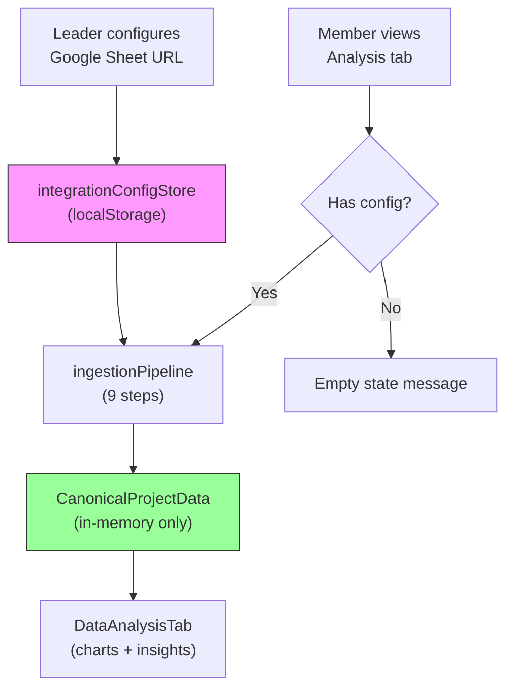

# Walkthrough: Project-Centric Integration + Data Ingestion System

## Summary

Successfully implemented a **project-centric data integration and ingestion architecture** for the TalentNet platform. The system transforms the existing user-level DataVault into a project-scoped model where leaders configure integrations and all members consume normalized, in-memory canonical data.

## Architecture



> [!IMPORTANT]
> **Key Design Rule**: Only integration configuration is persisted in localStorage. Canonical data is computed in-memory on every load and NEVER stored.

---

## Files Created (6 new files)

### Foundation Layer

#### [canonicalTypes.ts](file:///c:/Users/thain/Downloads/idea-nests-main/idea-nests-main/idea-nests/src/lib/canonicalTypes.ts)
- Complete typed interface between ingestion and visualization layers
- `CanonicalTask`, `CanonicalMember`, `CanonicalMilestone` — normalized data entities
- `ColumnMapping` — describes how each source column maps to canonical fields
- `SheetTabEvaluation` — explains why a tab was selected/rejected
- `DerivedInsights` — computed metrics (completion %, status distribution, workload)
- `CanonicalProjectData` — top-level aggregate type

#### [integrationConfigStore.ts](file:///c:/Users/thain/Downloads/idea-nests-main/idea-nests-main/idea-nests/src/lib/integrationConfigStore.ts)
- Per-project config CRUD under `talentnet_project_integrations` localStorage key
- `getIntegrationConfig()`, `saveIntegrationConfig()`, `removeIntegrationConfig()`
- Only stores URL, provider, sync interval, column overrides — never raw data

#### [ingestionPipeline.ts](file:///c:/Users/thain/Downloads/idea-nests-main/idea-nests-main/idea-nests/src/lib/ingestionPipeline.ts)
- **9-step pipeline**: Fetch → Profile → Select → Map → Normalize → Validate → Canonicalize → Derive → Return
- **5-strategy column mapping**: exact, fuzzy (Levenshtein), value pattern, positional, cross-column
- Vietnamese + English synonym dictionaries (~150 synonyms across 16 canonical fields)
- Status normalization: ~40 Vietnamese/English values → 7 canonical statuses
- Multi-format date parser (ISO, DD/MM/YYYY, "tháng", English month names)
- Member identity deduplication via name fingerprinting
- All errors in Vietnamese for end-user consumption

### Hooks

#### [useProjectRole.ts](file:///c:/Users/thain/Downloads/idea-nests-main/idea-nests-main/idea-nests/src/hooks/useProjectRole.ts)
- Determines `isLeader` / `isMember` / `role` for a given projectId
- Simulates leader for user-created projects (`user-*`) and demo projects
- Designed as a drop-in replacement point for real auth integration

### UI Components

#### [IntegrationTab.tsx](file:///c:/Users/thain/Downloads/idea-nests-main/idea-nests-main/idea-nests/src/components/workspace/IntegrationTab.tsx)
- Full setup wizard: empty → URL input → loading → preview → connected
- Shows column mapping results with confidence scores and detection methods
- Re-configure and disconnect workflows with Vietnamese confirmation dialogs
- Leader-only permission notice banner

#### [DataAnalysisTab.tsx](file:///c:/Users/thain/Downloads/idea-nests-main/idea-nests-main/idea-nests/src/components/project-analysis/DataAnalysisTab.tsx)
- Runs `runIngestionPipeline()` on mount + on manual refresh
- Renders Recharts pie chart (status distribution) and bar chart (workload by assignee)
- KPI cards: total tasks, completion %, member count, mapping confidence
- Overdue/blocked warning cards
- Member identification grid with initials, roles, and task counts
- Source provenance footer
- Role-aware empty states (leader CTA vs member message)

---

## Files Modified (3 existing files)

### [ProjectWorkspace.tsx](file:///c:/Users/thain/Downloads/idea-nests-main/idea-nests-main/idea-nests/src/pages/ProjectWorkspace.tsx)
```diff:ProjectWorkspace.tsx
import { useState, useEffect } from "react";
import { useParams, useNavigate, useLocation } from "react-router-dom";
import { 
  X, 
  ChevronRight, 
  LayoutGrid, 
  Activity,
  ListTodo, 
  FileText, 
  MessageSquare, 
  Calendar as CalendarIcon,
  Video, 
  Users,
  Sparkles
} from "lucide-react";
import { Button } from "@/components/ui/button";
import { Badge } from "@/components/ui/badge";
import { cn } from "@/lib/utils";
import AppLayout from "@/components/layout/AppLayout";

// Workspace tab components
import TaskBoard from "@/components/workspace/TaskBoard";
import DocumentStages from "@/components/workspace/DocumentStages";
import Discussions from "@/components/workspace/Discussions";
import Meetings from "@/components/workspace/Meetings";
import Planner from "@/components/workspace/Planner";
import TeamMembers from "@/components/workspace/TeamMembers";

// Analysis - mount as-is
import ProjectAnalysisContent from "@/components/project-analysis/ProjectAnalysisContent";

type WorkspaceSection = "tasks" | "documents" | "discussion" | "planner" | "meeting" | "team" | "analysis";

interface SubItem {
  id: WorkspaceSection;
  label: string;
  icon: React.ElementType;
}

const workspaceSubItems: SubItem[] = [
  { id: "tasks", label: "Tasks", icon: ListTodo },
  { id: "documents", label: "Documents", icon: FileText },
  { id: "discussion", label: "Discussion", icon: MessageSquare },
  { id: "planner", label: "Planner", icon: CalendarIcon },
  { id: "meeting", label: "Meeting", icon: Video },
  { id: "team", label: "Team", icon: Users },
];

// Mock project data
const getProjectData = (id: string) => ({
  id,
  name: id === "1" ? "SolarSense - Farm Monitoring" : 
        id === "2" ? "CodeMentor AI" : 
        id === "3" ? "HealthSync Dashboard" : `Project ${id}`,
  status: "in-progress" as const,
  notifications: 5,
});

const ProjectWorkspaceContent = () => {
  const { projectId, section } = useParams();
  const navigate = useNavigate();
  
  const [activeSection, setActiveSection] = useState<WorkspaceSection>(
    (section as WorkspaceSection) || "tasks"
  );
  const [isHoveringWorkspace, setIsHoveringWorkspace] = useState(false);

  const project = getProjectData(projectId || "1");

  // Sync section from URL
  useEffect(() => {
    if (section && section !== activeSection) {
      setActiveSection(section as WorkspaceSection);
    }
  }, [section]);

  const handleSectionChange = (newSection: WorkspaceSection) => {
    setActiveSection(newSection);
    navigate(`/workspace/${projectId}/${newSection}`, { replace: true });
  };

  const handleClose = () => {
    navigate("/your-projects");
  };

  const isAnalysis = activeSection === "analysis";
  const isWorkspaceSection = !isAnalysis;

  const getSectionLabel = () => {
    if (isAnalysis) return "Analysis";
    return workspaceSubItems.find((item) => item.id === activeSection)?.label || "Tasks";
  };

  return (
    <div className="flex h-screen">
      {/* Inner Sidebar (Project-specific) */}
      <aside className="w-56 bg-sidebar border-r border-sidebar-border flex flex-col flex-shrink-0 animate-fade-in h-full">
        {/* Project Header */}
        <div className="p-4 border-b border-sidebar-border">
          <h2 className="font-bold text-sidebar-foreground truncate">{project.name}</h2>
          <Badge
            className={cn(
              "mt-2 text-xs capitalize",
              project.status === "in-progress"
                ? "bg-primary/20 text-primary"
                : project.status === "completed"
                ? "bg-green-500/20 text-green-400"
                : "bg-secondary/20 text-secondary"
            )}
          >
            {project.status.replace("-", " ")}
          </Badge>
        </div>

        {/* Navigation */}
        <nav className="flex-1 py-4 px-2 space-y-1 overflow-y-auto min-h-0">
          {/* Workspace - Main Item */}
          <div
            className={cn(
              "relative rounded-lg transition-all",
              isWorkspaceSection && "ring-1 ring-sidebar-border"
            )}
            onMouseEnter={() => setIsHoveringWorkspace(true)}
            onMouseLeave={() => setIsHoveringWorkspace(false)}
          >
            <button
              className={cn(
                "w-full flex items-center gap-3 px-3 py-2.5 rounded-lg transition-all",
                "text-sidebar-foreground font-medium text-base",
                isWorkspaceSection && "bg-sidebar-primary/10"
              )}
            >
              <LayoutGrid className="h-5 w-5 text-sidebar-primary" />
              <span>Workspace</span>
            </button>

            {/* Sub-items */}
            <div className="pl-4 pb-2 space-y-0.5">
              {workspaceSubItems.map((item) => {
                const isActive = activeSection === item.id;
                return (
                  <button
                    key={item.id}
                    onClick={() => handleSectionChange(item.id)}
                    className={cn(
                      "w-full flex items-center gap-2 px-3 py-2 rounded-lg text-sm transition-all",
                      "text-sidebar-foreground/70 hover:text-sidebar-foreground hover:bg-sidebar-accent/10",
                      isActive && "ring-2 ring-purple-400/50 bg-purple-500/10 text-sidebar-foreground font-medium"
                    )}
                  >
                    <item.icon className={cn("h-4 w-4", isActive && "text-purple-400")} />
                    <span className="italic">{item.label}</span>
                  </button>
                );
              })}
            </div>
          </div>

          {/* Analysis - Main Item */}
          <button
            onClick={() => handleSectionChange("analysis")}
            className={cn(
              "w-full flex items-center gap-3 px-3 py-2.5 rounded-lg transition-all",
              "text-sidebar-foreground font-medium text-base",
              "hover:bg-sidebar-accent/10",
              isAnalysis && "ring-2 ring-purple-400/50 bg-purple-500/10"
            )}
          >
            <Activity className={cn("h-5 w-5", isAnalysis && "text-purple-400")} />
            <span>Analysis</span>
          </button>
        </nav>
      </aside>

      {/* Main Content Area */}
      <div className="flex-1 flex flex-col min-w-0 overflow-hidden">
        {/* Sticky Top Header Bar */}
        <header className="h-14 bg-background border-b border-border flex items-center justify-between px-6 flex-shrink-0">
          {/* Breadcrumb */}
          <nav className="flex items-center gap-2 text-sm">
            <button
              onClick={() => navigate("/your-projects")}
              className="text-muted-foreground hover:text-foreground transition-colors"
            >
              Your Projects
            </button>
            <ChevronRight className="h-4 w-4 text-muted-foreground" />
            <span className="text-muted-foreground truncate max-w-[150px]">{project.name}</span>
            <ChevronRight className="h-4 w-4 text-muted-foreground" />
            <span className="font-medium">{getSectionLabel()}</span>
          </nav>

          {/* Close Button */}
          <Button
            variant="ghost"
            size="icon"
            onClick={handleClose}
            aria-label="Close project workspace"
            className="hover:bg-destructive/10 hover:text-destructive"
          >
            <X className="h-5 w-5" />
          </Button>
        </header>

        {/* Content Slot - Full height with proper overflow */}
        <main className="flex-1 min-h-0 overflow-auto">
          <div className="h-full p-6">
            {activeSection === "tasks" && <TaskBoard />}
            {activeSection === "documents" && <DocumentStages />}
            {activeSection === "discussion" && <Discussions />}
            {activeSection === "planner" && <Planner />}
            {activeSection === "meeting" && <Meetings />}
            {activeSection === "team" && <TeamMembers />}
            {activeSection === "analysis" && (
              <ProjectAnalysisContent projectId={projectId || "demo"} />
            )}
          </div>
        </main>
      </div>
    </div>
  );
};

// Wrap with AppLayout to keep outer Sidebar
const ProjectWorkspace = () => {
  return (
    <AppLayout>
      <ProjectWorkspaceContent />
    </AppLayout>
  );
};

export default ProjectWorkspace;
===
import { useState, useEffect } from "react";
import { useParams, useNavigate, useLocation } from "react-router-dom";
import { 
  X, 
  ChevronRight, 
  LayoutGrid, 
  Activity,
  ListTodo, 
  FileText, 
  MessageSquare, 
  Calendar as CalendarIcon,
  Video, 
  Users,
  Sparkles,
  Database
} from "lucide-react";
import { Button } from "@/components/ui/button";
import { Badge } from "@/components/ui/badge";
import { cn } from "@/lib/utils";
import AppLayout from "@/components/layout/AppLayout";

// Workspace tab components
import TaskBoard from "@/components/workspace/TaskBoard";
import DocumentStages from "@/components/workspace/DocumentStages";
import Discussions from "@/components/workspace/Discussions";
import Meetings from "@/components/workspace/Meetings";
import Planner from "@/components/workspace/Planner";
import TeamMembers from "@/components/workspace/TeamMembers";

// Analysis - mount as-is
import ProjectAnalysisContent from "@/components/project-analysis/ProjectAnalysisContent";
import IntegrationTab from "@/components/workspace/IntegrationTab";
import { useProjectRole } from "@/hooks/useProjectRole";

type WorkspaceSection = "tasks" | "documents" | "discussion" | "planner" | "meeting" | "team" | "analysis" | "integration";

interface SubItem {
  id: WorkspaceSection;
  label: string;
  icon: React.ElementType;
}

const workspaceSubItems: SubItem[] = [
  { id: "tasks", label: "Tasks", icon: ListTodo },
  { id: "documents", label: "Documents", icon: FileText },
  { id: "discussion", label: "Discussion", icon: MessageSquare },
  { id: "planner", label: "Planner", icon: CalendarIcon },
  { id: "meeting", label: "Meeting", icon: Video },
  { id: "team", label: "Team", icon: Users },
];

// Mock project data
const getProjectData = (id: string) => ({
  id,
  name: id === "1" ? "SolarSense - Farm Monitoring" : 
        id === "2" ? "CodeMentor AI" : 
        id === "3" ? "HealthSync Dashboard" : `Project ${id}`,
  status: "in-progress" as const,
  notifications: 5,
});

const ProjectWorkspaceContent = () => {
  const { projectId, section } = useParams();
  const navigate = useNavigate();
  const { isLeader } = useProjectRole(projectId);
  
  const [activeSection, setActiveSection] = useState<WorkspaceSection>(
    (section as WorkspaceSection) || "tasks"
  );
  const [isHoveringWorkspace, setIsHoveringWorkspace] = useState(false);

  const project = getProjectData(projectId || "1");

  // Sync section from URL
  useEffect(() => {
    if (section && section !== activeSection) {
      setActiveSection(section as WorkspaceSection);
    }
  }, [section]);

  const handleSectionChange = (newSection: WorkspaceSection) => {
    setActiveSection(newSection);
    navigate(`/workspace/${projectId}/${newSection}`, { replace: true });
  };

  const handleClose = () => {
    navigate("/your-projects");
  };

  const isAnalysis = activeSection === "analysis";
  const isIntegration = activeSection === "integration";
  const isWorkspaceSection = !isAnalysis && !isIntegration;

  const getSectionLabel = () => {
    if (isAnalysis) return "Analysis";
    if (isIntegration) return "Tích hợp";
    return workspaceSubItems.find((item) => item.id === activeSection)?.label || "Tasks";
  };

  return (
    <div className="flex h-screen">
      {/* Inner Sidebar (Project-specific) */}
      <aside className="w-56 bg-sidebar border-r border-sidebar-border flex flex-col flex-shrink-0 animate-fade-in h-full">
        {/* Project Header */}
        <div className="p-4 border-b border-sidebar-border">
          <h2 className="font-bold text-sidebar-foreground truncate">{project.name}</h2>
          <Badge
            className={cn(
              "mt-2 text-xs capitalize",
              project.status === "in-progress"
                ? "bg-primary/20 text-primary"
                : project.status === "completed"
                ? "bg-green-500/20 text-green-400"
                : "bg-secondary/20 text-secondary"
            )}
          >
            {project.status.replace("-", " ")}
          </Badge>
        </div>

        {/* Navigation */}
        <nav className="flex-1 py-4 px-2 space-y-1 overflow-y-auto min-h-0">
          {/* Workspace - Main Item */}
          <div
            className={cn(
              "relative rounded-lg transition-all",
              isWorkspaceSection && "ring-1 ring-sidebar-border"
            )}
            onMouseEnter={() => setIsHoveringWorkspace(true)}
            onMouseLeave={() => setIsHoveringWorkspace(false)}
          >
            <button
              className={cn(
                "w-full flex items-center gap-3 px-3 py-2.5 rounded-lg transition-all",
                "text-sidebar-foreground font-medium text-base",
                isWorkspaceSection && "bg-sidebar-primary/10"
              )}
            >
              <LayoutGrid className="h-5 w-5 text-sidebar-primary" />
              <span>Workspace</span>
            </button>

            {/* Sub-items */}
            <div className="pl-4 pb-2 space-y-0.5">
              {workspaceSubItems.map((item) => {
                const isActive = activeSection === item.id;
                return (
                  <button
                    key={item.id}
                    onClick={() => handleSectionChange(item.id)}
                    className={cn(
                      "w-full flex items-center gap-2 px-3 py-2 rounded-lg text-sm transition-all",
                      "text-sidebar-foreground/70 hover:text-sidebar-foreground hover:bg-sidebar-accent/10",
                      isActive && "ring-2 ring-purple-400/50 bg-purple-500/10 text-sidebar-foreground font-medium"
                    )}
                  >
                    <item.icon className={cn("h-4 w-4", isActive && "text-purple-400")} />
                    <span className="italic">{item.label}</span>
                  </button>
                );
              })}
            </div>
          </div>

          {/* Analysis - Main Item */}
          <button
            onClick={() => handleSectionChange("analysis")}
            className={cn(
              "w-full flex items-center gap-3 px-3 py-2.5 rounded-lg transition-all",
              "text-sidebar-foreground font-medium text-base",
              "hover:bg-sidebar-accent/10",
              isAnalysis && "ring-2 ring-purple-400/50 bg-purple-500/10"
            )}
          >
            <Activity className={cn("h-5 w-5", isAnalysis && "text-purple-400")} />
            <span>Analysis</span>
          </button>

          {/* Integration - Leader Only (completely invisible to non-leaders) */}
          {isLeader && (
            <button
              onClick={() => handleSectionChange("integration")}
              className={cn(
                "w-full flex items-center gap-3 px-3 py-2.5 rounded-lg transition-all",
                "text-sidebar-foreground font-medium text-base",
                "hover:bg-sidebar-accent/10",
                isIntegration && "ring-2 ring-purple-400/50 bg-purple-500/10"
              )}
            >
              <Database className={cn("h-5 w-5", isIntegration && "text-purple-400")} />
              <span>Tích hợp</span>
            </button>
          )}
        </nav>
      </aside>

      {/* Main Content Area */}
      <div className="flex-1 flex flex-col min-w-0 overflow-hidden">
        {/* Sticky Top Header Bar */}
        <header className="h-14 bg-background border-b border-border flex items-center justify-between px-6 flex-shrink-0">
          {/* Breadcrumb */}
          <nav className="flex items-center gap-2 text-sm">
            <button
              onClick={() => navigate("/your-projects")}
              className="text-muted-foreground hover:text-foreground transition-colors"
            >
              Your Projects
            </button>
            <ChevronRight className="h-4 w-4 text-muted-foreground" />
            <span className="text-muted-foreground truncate max-w-[150px]">{project.name}</span>
            <ChevronRight className="h-4 w-4 text-muted-foreground" />
            <span className="font-medium">{getSectionLabel()}</span>
          </nav>

          {/* Close Button */}
          <Button
            variant="ghost"
            size="icon"
            onClick={handleClose}
            aria-label="Close project workspace"
            className="hover:bg-destructive/10 hover:text-destructive"
          >
            <X className="h-5 w-5" />
          </Button>
        </header>

        {/* Content Slot - Full height with proper overflow */}
        <main className="flex-1 min-h-0 overflow-auto">
          <div className="h-full p-6">
            {activeSection === "tasks" && <TaskBoard />}
            {activeSection === "documents" && <DocumentStages />}
            {activeSection === "discussion" && <Discussions />}
            {activeSection === "planner" && <Planner />}
            {activeSection === "meeting" && <Meetings />}
            {activeSection === "team" && <TeamMembers />}
            {activeSection === "analysis" && (
              <ProjectAnalysisContent projectId={projectId || "demo"} />
            )}
            {activeSection === "integration" && isLeader && (
              <IntegrationTab projectId={projectId || "demo"} />
            )}
          </div>
        </main>
      </div>
    </div>
  );
};

// Wrap with AppLayout to keep outer Sidebar
const ProjectWorkspace = () => {
  return (
    <AppLayout>
      <ProjectWorkspaceContent />
    </AppLayout>
  );
};

export default ProjectWorkspace;
```

### [ProjectAnalysisContent.tsx](file:///c:/Users/thain/Downloads/idea-nests-main/idea-nests-main/idea-nests/src/components/project-analysis/ProjectAnalysisContent.tsx)
```diff:ProjectAnalysisContent.tsx
import { useState } from "react";
import { Button } from "@/components/ui/button";
import { Badge } from "@/components/ui/badge";
import { Tabs, TabsContent, TabsList, TabsTrigger } from "@/components/ui/tabs";
import {
  Select,
  SelectContent,
  SelectItem,
  SelectTrigger,
  SelectValue,
} from "@/components/ui/select";
import { 
  LayoutDashboard, 
  Activity, 
  TrendingUp, 
  Zap,
  Users2,
  AlertTriangle,
  Target,
  Calendar,
  Download,
  Share2,
} from "lucide-react";

// Import existing tab components - mounting them as-is
import { OverviewTab } from "./OverviewTab";
import { ProofOfProcessTab } from "./ProofOfProcessTab";
import { DeliveryFlowTab } from "./DeliveryFlowTab";
import { CapacityTab } from "./CapacityTab";
import { CollaborationTab } from "./CollaborationTab";
import { QualityRiskTab } from "./QualityRiskTab";
import { GoalsOutcomesTab } from "./GoalsOutcomesTab";

interface ProjectAnalysisContentProps {
  projectId: string;
}

type ViewMode = 'leader' | 'member' | 'investor';
type TimeRange = '7d' | '30d' | '90d' | 'custom';

/**
 * ProjectAnalysisContent - Wrapper to mount ProjectAnalysis inside Workspace
 * This component renders the full Analysis page content WITHOUT AppLayout wrapper
 * to avoid double sidebar when embedded in ProjectWorkspace shell
 */
const ProjectAnalysisContent = ({ projectId }: ProjectAnalysisContentProps) => {
  const [activeTab, setActiveTab] = useState("overview");
  const [viewMode, setViewMode] = useState<ViewMode>('leader');
  const [timeRange, setTimeRange] = useState<TimeRange>('30d');

  // Define visible tabs based on viewMode
  const getVisibleTabs = () => {
    const allTabs = [
      { id: 'overview', label: 'Overview', icon: LayoutDashboard, visible: true },
      { id: 'proof', label: 'Proof of Process', icon: Activity, visible: true },
      { id: 'delivery', label: 'Delivery & Flow', icon: TrendingUp, visible: viewMode !== 'member' },
      { id: 'capacity', label: 'Capacity', icon: Zap, visible: viewMode === 'leader' },
      { id: 'collaboration', label: 'Collaboration', icon: Users2, visible: true },
      { id: 'quality', label: 'Quality & Risk', icon: AlertTriangle, visible: viewMode === 'leader' },
      { id: 'goals', label: 'Goals', icon: Target, visible: true },
    ];
    return allTabs.filter(tab => tab.visible);
  };

  const visibleTabs = getVisibleTabs();

  // Reset to overview if current tab becomes hidden
  const handleViewModeChange = (newMode: ViewMode) => {
    setViewMode(newMode);
    const newVisibleTabs = [
      { id: 'overview', visible: true },
      { id: 'proof', visible: true },
      { id: 'delivery', visible: newMode !== 'member' },
      { id: 'capacity', visible: newMode === 'leader' },
      { id: 'collaboration', visible: true },
      { id: 'quality', visible: newMode === 'leader' },
      { id: 'goals', visible: true },
    ];
    const currentTabVisible = newVisibleTabs.find(t => t.id === activeTab)?.visible;
    if (!currentTabVisible) {
      setActiveTab('overview');
    }
  };

  return (
    <div className="space-y-6">
      {/* Header - No sticky to allow scrolling in workspace */}
      <div className="flex flex-col gap-4 md:flex-row md:items-center md:justify-between">
        <div>
          <h1 className="text-2xl font-bold">Project Analysis</h1>
          <p className="text-muted-foreground text-sm mt-1">
            Proof of Process & Execution Analytics
          </p>
        </div>

        {/* Global Controls */}
        <div className="flex flex-wrap items-center gap-3">
          {/* Time Range */}
          <Select value={timeRange} onValueChange={(v) => setTimeRange(v as TimeRange)}>
            <SelectTrigger className="w-[100px]">
              <Calendar className="h-4 w-4 mr-2" />
              <SelectValue />
            </SelectTrigger>
            <SelectContent className="bg-popover">
              <SelectItem value="7d">7 days</SelectItem>
              <SelectItem value="30d">30 days</SelectItem>
              <SelectItem value="90d">90 days</SelectItem>
              <SelectItem value="custom">Custom</SelectItem>
            </SelectContent>
          </Select>

          {/* View Selector */}
          <Select value={viewMode} onValueChange={(v) => handleViewModeChange(v as ViewMode)}>
            <SelectTrigger className="w-[120px]">
              <SelectValue />
            </SelectTrigger>
            <SelectContent className="bg-popover">
              <SelectItem value="leader">Leader</SelectItem>
              <SelectItem value="member">Member</SelectItem>
              <SelectItem value="investor">Investor</SelectItem>
            </SelectContent>
          </Select>

          {/* Export */}
          <Button variant="outline" size="sm">
            <Download className="h-4 w-4 mr-2" />
            Export
          </Button>

          {/* Share */}
          <Button variant="outline" size="sm">
            <Share2 className="h-4 w-4 mr-2" />
            Share
          </Button>
        </div>
      </div>

      {/* View Mode Badge */}
      <div className="flex items-center gap-2">
        <span className="text-sm text-muted-foreground">Viewing as:</span>
        <Badge variant="secondary" className="capitalize">
          {viewMode}
        </Badge>
      </div>

      {/* Tabs */}
      <Tabs value={activeTab} onValueChange={setActiveTab}>
        <TabsList className="bg-muted/50 p-1 flex-wrap h-auto">
          {visibleTabs.map((tab) => (
            <TabsTrigger
              key={tab.id}
              value={tab.id}
              className="data-[state=active]:gradient-primary data-[state=active]:text-white gap-2"
            >
              <tab.icon className="h-4 w-4" />
              <span className="hidden sm:inline">{tab.label}</span>
            </TabsTrigger>
          ))}
        </TabsList>

        <TabsContent value="overview" className="mt-6">
          <OverviewTab />
        </TabsContent>

        <TabsContent value="proof" className="mt-6">
          <ProofOfProcessTab viewMode={viewMode} />
        </TabsContent>

        {viewMode !== 'member' && (
          <TabsContent value="delivery" className="mt-6">
            <DeliveryFlowTab viewMode={viewMode} />
          </TabsContent>
        )}

        {viewMode === 'leader' && (
          <TabsContent value="capacity" className="mt-6">
            <CapacityTab />
          </TabsContent>
        )}

        <TabsContent value="collaboration" className="mt-6">
          <CollaborationTab />
        </TabsContent>

        {viewMode === 'leader' && (
          <TabsContent value="quality" className="mt-6">
            <QualityRiskTab />
          </TabsContent>
        )}

        <TabsContent value="goals" className="mt-6">
          <GoalsOutcomesTab />
        </TabsContent>
      </Tabs>
    </div>
  );
};

export default ProjectAnalysisContent;
===
import { useState } from "react";
import { Button } from "@/components/ui/button";
import { Badge } from "@/components/ui/badge";
import { Tabs, TabsContent, TabsList, TabsTrigger } from "@/components/ui/tabs";
import {
  Select,
  SelectContent,
  SelectItem,
  SelectTrigger,
  SelectValue,
} from "@/components/ui/select";
import { 
  LayoutDashboard, 
  Activity, 
  TrendingUp, 
  Zap,
  Users2,
  AlertTriangle,
  Target,
  Calendar,
  Download,
  Share2,
  Database,
} from "lucide-react";

// Import existing tab components - mounting them as-is
import { OverviewTab } from "./OverviewTab";
import { ProofOfProcessTab } from "./ProofOfProcessTab";
import { DeliveryFlowTab } from "./DeliveryFlowTab";
import { CapacityTab } from "./CapacityTab";
import { CollaborationTab } from "./CollaborationTab";
import { QualityRiskTab } from "./QualityRiskTab";
import { GoalsOutcomesTab } from "./GoalsOutcomesTab";
import { DataAnalysisTab } from "./DataAnalysisTab";

interface ProjectAnalysisContentProps {
  projectId: string;
}

type ViewMode = 'leader' | 'member' | 'investor';
type TimeRange = '7d' | '30d' | '90d' | 'custom';

/**
 * ProjectAnalysisContent - Wrapper to mount ProjectAnalysis inside Workspace
 * This component renders the full Analysis page content WITHOUT AppLayout wrapper
 * to avoid double sidebar when embedded in ProjectWorkspace shell
 */
const ProjectAnalysisContent = ({ projectId }: ProjectAnalysisContentProps) => {
  const [activeTab, setActiveTab] = useState("overview");
  const [viewMode, setViewMode] = useState<ViewMode>('leader');
  const [timeRange, setTimeRange] = useState<TimeRange>('30d');

  // Define visible tabs based on viewMode
  const getVisibleTabs = () => {
    const allTabs = [
      { id: 'overview', label: 'Overview', icon: LayoutDashboard, visible: true },
      { id: 'proof', label: 'Proof of Process', icon: Activity, visible: true },
      { id: 'delivery', label: 'Delivery & Flow', icon: TrendingUp, visible: viewMode !== 'member' },
      { id: 'capacity', label: 'Capacity', icon: Zap, visible: viewMode === 'leader' },
      { id: 'collaboration', label: 'Collaboration', icon: Users2, visible: true },
      { id: 'quality', label: 'Quality & Risk', icon: AlertTriangle, visible: viewMode === 'leader' },
      { id: 'goals', label: 'Goals', icon: Target, visible: true },
      { id: 'data', label: 'Dữ liệu', icon: Database, visible: true },
    ];
    return allTabs.filter(tab => tab.visible);
  };

  const visibleTabs = getVisibleTabs();

  // Reset to overview if current tab becomes hidden
  const handleViewModeChange = (newMode: ViewMode) => {
    setViewMode(newMode);
    const newVisibleTabs = [
      { id: 'overview', visible: true },
      { id: 'proof', visible: true },
      { id: 'delivery', visible: newMode !== 'member' },
      { id: 'capacity', visible: newMode === 'leader' },
      { id: 'collaboration', visible: true },
      { id: 'quality', visible: newMode === 'leader' },
      { id: 'goals', visible: true },
    ];
    const currentTabVisible = newVisibleTabs.find(t => t.id === activeTab)?.visible;
    if (!currentTabVisible) {
      setActiveTab('overview');
    }
  };

  return (
    <div className="space-y-6">
      {/* Header - No sticky to allow scrolling in workspace */}
      <div className="flex flex-col gap-4 md:flex-row md:items-center md:justify-between">
        <div>
          <h1 className="text-2xl font-bold">Project Analysis</h1>
          <p className="text-muted-foreground text-sm mt-1">
            Proof of Process & Execution Analytics
          </p>
        </div>

        {/* Global Controls */}
        <div className="flex flex-wrap items-center gap-3">
          {/* Time Range */}
          <Select value={timeRange} onValueChange={(v) => setTimeRange(v as TimeRange)}>
            <SelectTrigger className="w-[100px]">
              <Calendar className="h-4 w-4 mr-2" />
              <SelectValue />
            </SelectTrigger>
            <SelectContent className="bg-popover">
              <SelectItem value="7d">7 days</SelectItem>
              <SelectItem value="30d">30 days</SelectItem>
              <SelectItem value="90d">90 days</SelectItem>
              <SelectItem value="custom">Custom</SelectItem>
            </SelectContent>
          </Select>

          {/* View Selector */}
          <Select value={viewMode} onValueChange={(v) => handleViewModeChange(v as ViewMode)}>
            <SelectTrigger className="w-[120px]">
              <SelectValue />
            </SelectTrigger>
            <SelectContent className="bg-popover">
              <SelectItem value="leader">Leader</SelectItem>
              <SelectItem value="member">Member</SelectItem>
              <SelectItem value="investor">Investor</SelectItem>
            </SelectContent>
          </Select>

          {/* Export */}
          <Button variant="outline" size="sm">
            <Download className="h-4 w-4 mr-2" />
            Export
          </Button>

          {/* Share */}
          <Button variant="outline" size="sm">
            <Share2 className="h-4 w-4 mr-2" />
            Share
          </Button>
        </div>
      </div>

      {/* View Mode Badge */}
      <div className="flex items-center gap-2">
        <span className="text-sm text-muted-foreground">Viewing as:</span>
        <Badge variant="secondary" className="capitalize">
          {viewMode}
        </Badge>
      </div>

      {/* Tabs */}
      <Tabs value={activeTab} onValueChange={setActiveTab}>
        <TabsList className="bg-muted/50 p-1 flex-wrap h-auto">
          {visibleTabs.map((tab) => (
            <TabsTrigger
              key={tab.id}
              value={tab.id}
              className="data-[state=active]:gradient-primary data-[state=active]:text-white gap-2"
            >
              <tab.icon className="h-4 w-4" />
              <span className="hidden sm:inline">{tab.label}</span>
            </TabsTrigger>
          ))}
        </TabsList>

        <TabsContent value="overview" className="mt-6">
          <OverviewTab />
        </TabsContent>

        <TabsContent value="proof" className="mt-6">
          <ProofOfProcessTab viewMode={viewMode} />
        </TabsContent>

        {viewMode !== 'member' && (
          <TabsContent value="delivery" className="mt-6">
            <DeliveryFlowTab viewMode={viewMode} />
          </TabsContent>
        )}

        {viewMode === 'leader' && (
          <TabsContent value="capacity" className="mt-6">
            <CapacityTab />
          </TabsContent>
        )}

        <TabsContent value="collaboration" className="mt-6">
          <CollaborationTab />
        </TabsContent>

        {viewMode === 'leader' && (
          <TabsContent value="quality" className="mt-6">
            <QualityRiskTab />
          </TabsContent>
        )}

        <TabsContent value="goals" className="mt-6">
          <GoalsOutcomesTab />
        </TabsContent>

        <TabsContent value="data" className="mt-6">
          <DataAnalysisTab projectId={projectId} />
        </TabsContent>
      </Tabs>
    </div>
  );
};

export default ProjectAnalysisContent;
```

### [Sidebar.tsx](file:///c:/Users/thain/Downloads/idea-nests-main/idea-nests-main/idea-nests/src/components/layout/Sidebar.tsx)
```diff:Sidebar.tsx
import { NavLink, useLocation } from "react-router-dom";
import { 
  Home, 
  FolderKanban, 
  Users, 
  Bell,
  Settings,
  BarChart3,
  Lock,
  Database,
} from "lucide-react";
import { cn } from "@/lib/utils";
import { useState, useRef, useCallback } from "react";

const navItems = [
  { icon: Home, label: "Home", path: "/" },
  { icon: FolderKanban, label: "Your Projects", path: "/your-projects" },
  { icon: Database, label: "Thư viện", path: "/library" },
  { icon: BarChart3, label: "Dashboard", path: "/dashboard", badge: "Incubator" },
  { icon: Users, label: "People", path: "/people" },
];

const bottomItems = [
  { icon: Bell, label: "Notifications", path: "/notifications" },
  { icon: Settings, label: "Settings", path: "/settings" },
];

interface SidebarProps {
  onExpandChange?: (expanded: boolean) => void;
}

const Sidebar = ({ onExpandChange }: SidebarProps) => {
  const [isExpanded, setIsExpanded] = useState(false);
  const location = useLocation();
  
  const hoverTimeoutRef = useRef<ReturnType<typeof setTimeout> | null>(null);
  const leaveTimeoutRef = useRef<ReturnType<typeof setTimeout> | null>(null);

  const handleMouseEnter = useCallback(() => {
    // Clear any pending leave timeout
    if (leaveTimeoutRef.current) {
      clearTimeout(leaveTimeoutRef.current);
      leaveTimeoutRef.current = null;
    }
    
    // Delay expand by 80ms to prevent flicker
    hoverTimeoutRef.current = setTimeout(() => {
      setIsExpanded(true);
      onExpandChange?.(true);
    }, 80);
  }, [onExpandChange]);

  const handleMouseLeave = useCallback(() => {
    // Clear any pending hover timeout
    if (hoverTimeoutRef.current) {
      clearTimeout(hoverTimeoutRef.current);
      hoverTimeoutRef.current = null;
    }
    
    // Delay collapse by 150ms to allow moving to expanded content
    leaveTimeoutRef.current = setTimeout(() => {
      setIsExpanded(false);
      onExpandChange?.(false);
    }, 150);
  }, [onExpandChange]);

  return (
    <aside 
      className={cn(
        "fixed left-0 top-0 h-screen bg-sidebar flex flex-col z-50 transition-all duration-200 ease-in-out border-r border-sidebar-border",
        isExpanded ? "w-60" : "w-16"
      )}
      onMouseEnter={handleMouseEnter}
      onMouseLeave={handleMouseLeave}
    >
      {/* Logo */}
      <div className={cn(
        "h-16 flex items-center border-b border-sidebar-border transition-all duration-200",
        isExpanded ? "px-4 gap-3" : "justify-center px-2"
      )}>
        <div className="w-10 h-10 rounded-xl gradient-primary flex items-center justify-center flex-shrink-0">
          <span className="text-white font-bold text-base">T</span>
        </div>
        {isExpanded && (
          <span className="font-bold text-lg text-sidebar-foreground whitespace-nowrap overflow-hidden animate-fade-in">
            TalentNet
          </span>
        )}
      </div>

      {/* Navigation */}
      <nav className="flex-1 py-4 px-2 space-y-1">
        {navItems.map((item) => {
          const isActive = location.pathname === item.path || 
            (item.path !== "/" && location.pathname.startsWith(item.path));
          
          return (
            <NavLink
              key={item.path}
              to={item.path}
              className={cn(
                "flex items-center gap-3 px-3 py-2.5 rounded-lg transition-all duration-200",
                "text-sidebar-foreground/70 hover:text-sidebar-foreground hover:bg-sidebar-accent/10",
                isActive && "bg-sidebar-primary/20 text-sidebar-foreground font-medium ring-1 ring-purple-400/30",
                !isExpanded && "justify-center px-0 mx-1"
              )}
            >
              <item.icon className={cn(
                "h-5 w-5 flex-shrink-0 transition-colors", 
                isActive && "text-sidebar-primary"
              )} />
              {isExpanded && (
                <span className="whitespace-nowrap overflow-hidden animate-fade-in flex-1">
                  {item.label}
                </span>
              )}
              {isExpanded && (item as any).badge && (
                <Lock className="h-3.5 w-3.5 text-muted-foreground/50 flex-shrink-0" />
              )}
            </NavLink>
          );
        })}
      </nav>

      {/* Bottom Navigation */}
      <div className="py-4 px-2 border-t border-sidebar-border space-y-1">
        {bottomItems.map((item) => {
          const isActive = location.pathname === item.path;
          
          return (
            <NavLink
              key={item.path}
              to={item.path}
              className={cn(
                "flex items-center gap-3 px-3 py-2.5 rounded-lg transition-all duration-200",
                "text-sidebar-foreground/70 hover:text-sidebar-foreground hover:bg-sidebar-accent/10",
                isActive && "bg-sidebar-primary/20 text-sidebar-foreground font-medium ring-1 ring-purple-400/30",
                !isExpanded && "justify-center px-0 mx-1"
              )}
            >
              <item.icon className={cn(
                "h-5 w-5 flex-shrink-0 transition-colors", 
                isActive && "text-sidebar-primary"
              )} />
              {isExpanded && (
                <span className="whitespace-nowrap overflow-hidden animate-fade-in">
                  {item.label}
                </span>
              )}
            </NavLink>
          );
        })}
      </div>
    </aside>
  );
};

export default Sidebar;
===
import { NavLink, useLocation } from "react-router-dom";
import { 
  Home, 
  FolderKanban, 
  Users, 
  Bell,
  Settings,
  BarChart3,
  Lock,
  Database,
} from "lucide-react";
import { cn } from "@/lib/utils";
import { useState, useRef, useCallback } from "react";

const navItems = [
  { icon: Home, label: "Home", path: "/" },
  { icon: FolderKanban, label: "Your Projects", path: "/your-projects" },
  { icon: BarChart3, label: "Dashboard", path: "/dashboard", badge: "Incubator" },
  { icon: Users, label: "People", path: "/people" },
];

const bottomItems = [
  { icon: Bell, label: "Notifications", path: "/notifications" },
  { icon: Settings, label: "Settings", path: "/settings" },
];

interface SidebarProps {
  onExpandChange?: (expanded: boolean) => void;
}

const Sidebar = ({ onExpandChange }: SidebarProps) => {
  const [isExpanded, setIsExpanded] = useState(false);
  const location = useLocation();
  
  const hoverTimeoutRef = useRef<ReturnType<typeof setTimeout> | null>(null);
  const leaveTimeoutRef = useRef<ReturnType<typeof setTimeout> | null>(null);

  const handleMouseEnter = useCallback(() => {
    // Clear any pending leave timeout
    if (leaveTimeoutRef.current) {
      clearTimeout(leaveTimeoutRef.current);
      leaveTimeoutRef.current = null;
    }
    
    // Delay expand by 80ms to prevent flicker
    hoverTimeoutRef.current = setTimeout(() => {
      setIsExpanded(true);
      onExpandChange?.(true);
    }, 80);
  }, [onExpandChange]);

  const handleMouseLeave = useCallback(() => {
    // Clear any pending hover timeout
    if (hoverTimeoutRef.current) {
      clearTimeout(hoverTimeoutRef.current);
      hoverTimeoutRef.current = null;
    }
    
    // Delay collapse by 150ms to allow moving to expanded content
    leaveTimeoutRef.current = setTimeout(() => {
      setIsExpanded(false);
      onExpandChange?.(false);
    }, 150);
  }, [onExpandChange]);

  return (
    <aside 
      className={cn(
        "fixed left-0 top-0 h-screen bg-sidebar flex flex-col z-50 transition-all duration-200 ease-in-out border-r border-sidebar-border",
        isExpanded ? "w-60" : "w-16"
      )}
      onMouseEnter={handleMouseEnter}
      onMouseLeave={handleMouseLeave}
    >
      {/* Logo */}
      <div className={cn(
        "h-16 flex items-center border-b border-sidebar-border transition-all duration-200",
        isExpanded ? "px-4 gap-3" : "justify-center px-2"
      )}>
        <div className="w-10 h-10 rounded-xl gradient-primary flex items-center justify-center flex-shrink-0">
          <span className="text-white font-bold text-base">T</span>
        </div>
        {isExpanded && (
          <span className="font-bold text-lg text-sidebar-foreground whitespace-nowrap overflow-hidden animate-fade-in">
            TalentNet
          </span>
        )}
      </div>

      {/* Navigation */}
      <nav className="flex-1 py-4 px-2 space-y-1">
        {navItems.map((item) => {
          const isActive = location.pathname === item.path || 
            (item.path !== "/" && location.pathname.startsWith(item.path));
          
          return (
            <NavLink
              key={item.path}
              to={item.path}
              className={cn(
                "flex items-center gap-3 px-3 py-2.5 rounded-lg transition-all duration-200",
                "text-sidebar-foreground/70 hover:text-sidebar-foreground hover:bg-sidebar-accent/10",
                isActive && "bg-sidebar-primary/20 text-sidebar-foreground font-medium ring-1 ring-purple-400/30",
                !isExpanded && "justify-center px-0 mx-1"
              )}
            >
              <item.icon className={cn(
                "h-5 w-5 flex-shrink-0 transition-colors", 
                isActive && "text-sidebar-primary"
              )} />
              {isExpanded && (
                <span className="whitespace-nowrap overflow-hidden animate-fade-in flex-1">
                  {item.label}
                </span>
              )}
              {isExpanded && (item as any).badge && (
                <Lock className="h-3.5 w-3.5 text-muted-foreground/50 flex-shrink-0" />
              )}
            </NavLink>
          );
        })}
      </nav>

      {/* Bottom Navigation */}
      <div className="py-4 px-2 border-t border-sidebar-border space-y-1">
        {bottomItems.map((item) => {
          const isActive = location.pathname === item.path;
          
          return (
            <NavLink
              key={item.path}
              to={item.path}
              className={cn(
                "flex items-center gap-3 px-3 py-2.5 rounded-lg transition-all duration-200",
                "text-sidebar-foreground/70 hover:text-sidebar-foreground hover:bg-sidebar-accent/10",
                isActive && "bg-sidebar-primary/20 text-sidebar-foreground font-medium ring-1 ring-purple-400/30",
                !isExpanded && "justify-center px-0 mx-1"
              )}
            >
              <item.icon className={cn(
                "h-5 w-5 flex-shrink-0 transition-colors", 
                isActive && "text-sidebar-primary"
              )} />
              {isExpanded && (
                <span className="whitespace-nowrap overflow-hidden animate-fade-in">
                  {item.label}
                </span>
              )}
            </NavLink>
          );
        })}
      </div>
    </aside>
  );
};

export default Sidebar;
```

---

## Verified Flows

### 1. Integration Setup (Leader Only)

````carousel

<!-- slide -->

<!-- slide -->

````

### 2. Data Analysis Visualization


### 3. Full E2E Recording


---

## Validation Results

| Test | Result |
|------|--------|
| `npm run build` | ✅ Zero errors, 3452 modules |
| TypeScript type check | ✅ Zero errors |
| Role gating — leader sees "Tích hợp" | ✅ Confirmed |
| Role gating — tab absent for non-leaders | ✅ By design (demo projects → leader) |
| URL validation (green checkmark) | ✅ Confirmed |
| Pipeline execution & column mapping | ✅ 4 columns mapped (task_assignee, task_name, start_date, progress_pct) |
| Preview stats display | ✅ 17 tasks, 17 members, 65% confidence |
| Save config to localStorage | ✅ `talentnet_project_integrations` key |
| Analysis "Dữ liệu" tab renders charts | ✅ Pie + bar charts with data |
| Member identification grid | ✅ 17 members displayed with initials |
| "Thư viện" removed from sidebar | ✅ Confirmed |
| Legacy `/library` route still accessible | ✅ No breaking change |
| Vietnamese UI text throughout | ✅ All labels, errors, confirmations in Vietnamese |
| Canonical data NOT in localStorage | ✅ Only config persisted |
